    

### I'm Alexandre Reza, a full-time full-stack developer based in Paris 🚀
<i style="font-style: italic">(you can call me either <b>Alexandre</b> or <b>Reza</b>)</i>

🥼Working at [WhiteLab Genomics](https://www.whitelabgx.com)   

### Get in touch (if you want)  

  

   

 

   

 My Skill Set 

<table><tr><td valign="top" width="33%">

### Frontend  

  
  
  
  
  
  
  
  
  
  
  
  
  
  
  

  

### UI/UX  

  
  
  
  
  
  

</td><td valign="top" width="33%">

### Backend  

      
      
      
      
      
      
      
      
      
      
      
      
      
    

</td><td valign="top" width="33%">

### DevOps  

  
      
      
      
      
      
      
      
      

</td></tr></table>

    

