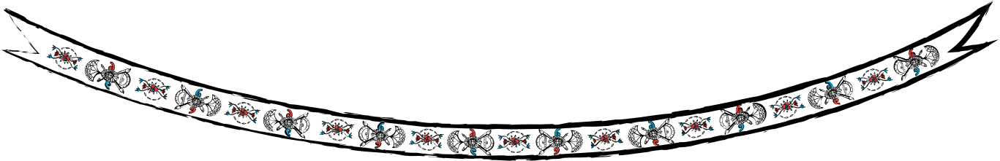

<!-- Header -->

    
    

<!-- Aside / Badges -->

    
    
    
    

 
<!-- Info display mode -->

 
<!-- Skills Section -->

    
    
    
    

 
<!-- Contributions / Activity -->

    
    

<!--START_SECTION:activity-->
<!--END_SECTION:activity-->

 
<!-- Footer -->

    
    

